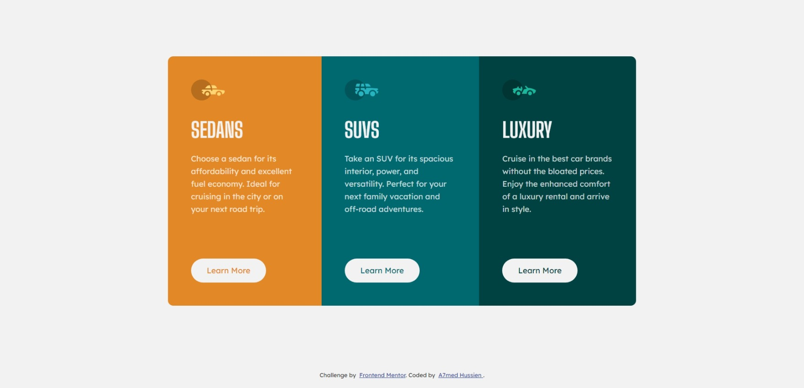

# Frontend Mentor - 3-column preview card component solution

This is a solution to the [3-column preview card component challenge on Frontend Mentor](https://www.frontendmentor.io/challenges/3column-preview-card-component-pH92eAR2-). Frontend Mentor challenges help you improve your coding skills by building realistic projects.

## Table of contents

- [Overview](#overview)
  - [The challenge](#the-challenge)
  - [Screenshot](#screenshot)
  - [Links](#links)
- [My process](#my-process)
  - [Built with](#built-with)
  - [What I learned](#what-i-learned)
- [Author](#author)

## Overview

### The challenge

Users should be able to:

- View the optimal layout depending on their device's screen size
- See hover states for interactive elements

### Screenshot

### Links

- Solution URL: [https://github.com/Eng-Ahmed-Hussien/Frontend-Mentor-Challenges/tree/main/3-column-preview-card-component](https://github.com/Eng-Ahmed-Hussien/Frontend-Mentor-Challenges/tree/main/3-column-preview-card-component)
- Live Site URL: [https://eng-ahmed-hussien.github.io/Frontend-Mentor-Challenges/3-column-preview-card-component/](https://eng-ahmed-hussien.github.io/Frontend-Mentor-Challenges/3-column-preview-card-component/)

## My process

### Built with

- HTML
- CSS

### What I learned

Improved HTML and CSS skills

## Author

- Frontend Mentor - [A7med Hussien](https://www.frontendmentor.io/profile/Eng-Ahmed-Hussien)
- Linkedin - [Ahmed Hussien](https://www.linkedin.com/in/ahmed-hussien-front-end-developer/)
