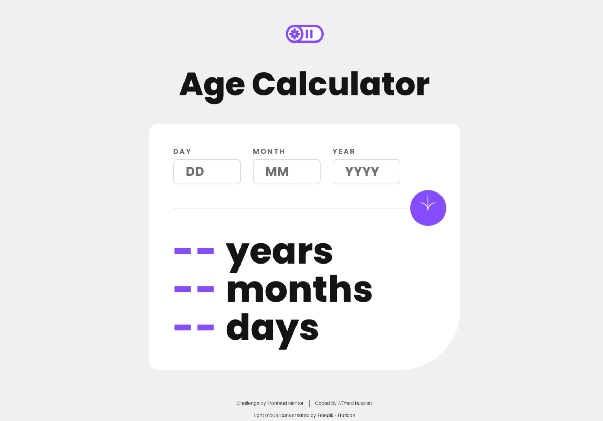

# Frontend Mentor - Age calculator app v2 solution

This is a solution to the [Age calculator app challenge on Frontend Mentor](https://www.frontendmentor.io/challenges/Age-calculator-app-V2-dF9DFFpj-Q). Frontend Mentor challenges help you improve your coding skills by building realistic projects.

## Table of contents

- [Overview](#overview)
  - [The challenge](#the-challenge)
  - [Screenshot](#screenshot)
  - [Links](#links)
- [My process](#my-process)
  - [Built with](#built-with)
  - [What I learned](#what-i-learned)
  - [Useful resources](#useful-resources)
- [Author](#author)
- [Acknowledgments](#acknowledgments)

## Overview

### The challenge

Users should be able to:

- View an age in years, months, and days after submitting a valid date through the form
- Receive validation errors if:
  - Any field is empty when the form is submitted
  - The day number is not between 1-31
  - The month number is not between 1-12
  - The year is in the future
  - The date is invalid e.g. 31/04/1991 (there are 30 days in April)
- View the optimal layout for the interface depending on their device's screen size
- See hover and focus states for all interactive elements on the page
- **Bonus**: See the age numbers animate to their final number when the form is submitted

### Screenshot

#### Light Mode



#### Dark Mood


### Links

- Solution URL: [https://github.com/Eng-Ahmed-Hussien/Frontend-Mentor-Challenges/tree/main/Age-calculator-app-V2](https://github.com/Eng-Ahmed-Hussien/Frontend-Mentor-Challenges/tree/main/Age-calculator-app-V2)
- Live Site URL: [https://eng-ahmed-hussien.github.io/Frontend-Mentor-Challenges/Age-calculator-app-V2/](https://eng-ahmed-hussien.github.io/Frontend-Mentor-Challenges/Age-calculator-app-V2/)

## My process

### Built with

- HTML
- CSS
- JavaScript

### What I learned

Creating counter animations for displaying the number results.

```js
// display numbers
function displayNumbers() {
  // display years
  countingYears = setInterval(updateYears, 20);

  // display months
  countingMonths = setInterval(updateMonths, 20);

  // display days
  countingDays = setInterval(updateDays, 20);
}

// month counter
function updateMonths() {
  if (monthCounter === monthCalc) {
    clearInterval(countingMonths);
  }
  monthOut.innerText = monthCounter++;
}

// year counter
function updateYears() {
  if (yearCounter === yearCalc) {
    clearInterval(countingYears);
  }
  yearOut.innerText = yearCounter++;
}

// day counter
function updateDays() {
  if (dayCounter === dayCalc) {
    clearInterval(countingDays);
  }
  dayOut.innerText = dayCounter++;
}
```

### Useful resources

- [GeeksforGeeks | How to make animated counter using JavaScript ?](https://www.geeksforgeeks.org/how-to-make-animated-counter-using-javascript/) - Idea for creating an animated counter.

- [MDN Web Docs | setInterval() global function](https://developer.mozilla.org/en-US/docs/Web/API/setInterval) - Very helpful for a better understanding of the function used to create the animation.

## Author

- Frontend Mentor - [A7med Hussien](https://www.frontendmentor.io/profile/Eng-Ahmed-Hussien)
- Linkedin - [Ahmed Hussien](https://www.linkedin.com/in/ahmed-hussien-front-end-developer/)

## Acknowledgments

Light mode icons created by [Freepik - Flaticon](https://www.flaticon.com/free-icons/light-mode)
