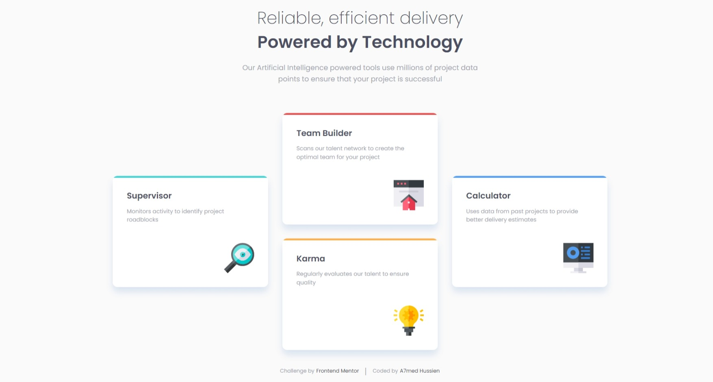

# Frontend Mentor - Four card feature section solution

This is a solution to the [Four card feature section challenge on Frontend Mentor](https://www.frontendmentor.io/challenges/four-card-feature-section-weK1eFYK). Frontend Mentor challenges help you improve your coding skills by building realistic projects.

## Table of contents

- [Overview](#overview)
  - [The challenge](#the-challenge)
  - [Screenshot](#screenshot)
  - [Links](#links)
- [My process](#my-process)
  - [Built with](#built-with)
  - [What I learned](#what-i-learned)
- [Author](#author)

## Overview

### The challenge

Users should be able to:

- View the optimal layout for the site depending on their device's screen size

### Screenshot



### Links

- Solution URL: [https://github.com/Eng-Ahmed-Hussien/Frontend-Mentor-Challenges/tree/main/Four-card-feature-section](https://github.com/Eng-Ahmed-Hussien/Frontend-Mentor-Challenges/tree/main/Four-card-feature-section)
- Live Site URL: [https://eng-ahmed-hussien.github.io/Frontend-Mentor-Challenges/Four-card-feature-section/](https://eng-ahmed-hussien.github.io/Frontend-Mentor-Challenges/Four-card-feature-section/)

## My process

### Built with

- HTML
- CSS

### What I learned

Using css grid to display the feature cards

```css
.card-section {
  max-width: 105rem;

  display: grid;
  grid-template-columns: 1fr 1fr 1fr;
  align-items: center;
  gap: 3rem;
}

.supervisor {
  grid-column: 1 / 2;
  grid-row: 1 / 3;
}

.team-builder {
  grid-column: 2 / 3;
  grid-row: 1 / 2;
}

.karma {
  grid-column: 2 / 3;
  grid-row: 2 / 3;
}

.calculator {
  grid-column: -2 / -1;
  grid-row: 1 / 3;
}
```

## Author

- Frontend Mentor - [A7med Hussien](https://www.frontendmentor.io/profile/Eng-Ahmed-Hussien)
- Linkedin - [Ahmed Hussien](https://www.linkedin.com/in/ahmed-hussien-front-end-developer/)
