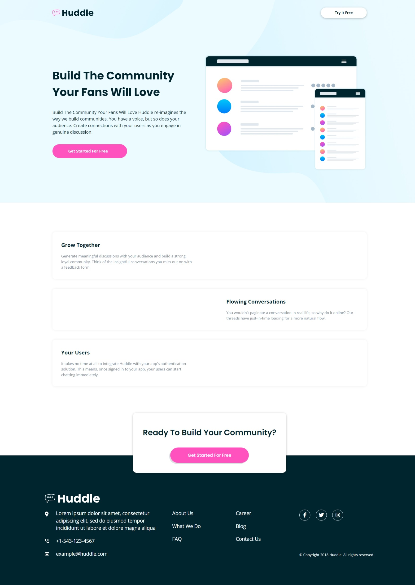

# Frontend Mentor - Huddle landing page with alternating feature blocks solution

This is a solution to the [Huddle landing page with alternating feature blocks challenge on Frontend Mentor](https://www.frontendmentor.io/challenges/huddle-landing-page-with-alternating-feature-blocks-5ca5f5981e82137ec91a5100). Frontend Mentor challenges help you improve your coding skills by building realistic projects.

## Table of contents

- [Overview](#overview)
  - [The challenge](#the-challenge)
  - [Screenshot](#screenshot)
  - [Links](#links)
- [Process](#process)
  - [Built with](#built-with)
  - [What I learned](#what-i-learned)
- [Author](#author)

## Overview

### The challenge

Users should be able to:

- View the optimal layout for the site depending on their device's screen size
- See hover states for all interactive elements on the page

### Screenshot

### Links

- Solution URL: [https://github.com/Eng-Ahmed-Hussien/Frontend-Mentor-Challenges/tree/main/Huddle-landing-page](https://github.com/Eng-Ahmed-Hussien/Frontend-Mentor-Challenges/tree/main/Huddle-landing-page)
- Live Site URL: [https://eng-ahmed-hussien.github.io/Frontend-Mentor-Challenges/Huddle-landing-page/](https://eng-ahmed-hussien.github.io/Frontend-Mentor-Challenges/Huddle-landing-page/)

## Process

### Built with

- HTML
- CSS

### What I learned

In this project, I learned how to create a responsive layout using CSS Flexbox and Grid. I also improved my skills in writing clean and maintainable HTML and CSS code. Additionally, I gained experience in implementing hover states for interactive elements to enhance the user experience.

## Author

- Frontend Mentor - [A7med Hussien](https://www.frontendmentor.io/profile/Eng-Ahmed-Hussien)
- Linkedin - [Ahmed Hussien](https://www.linkedin.com/in/ahmed-hussien-front-end-developer/)
