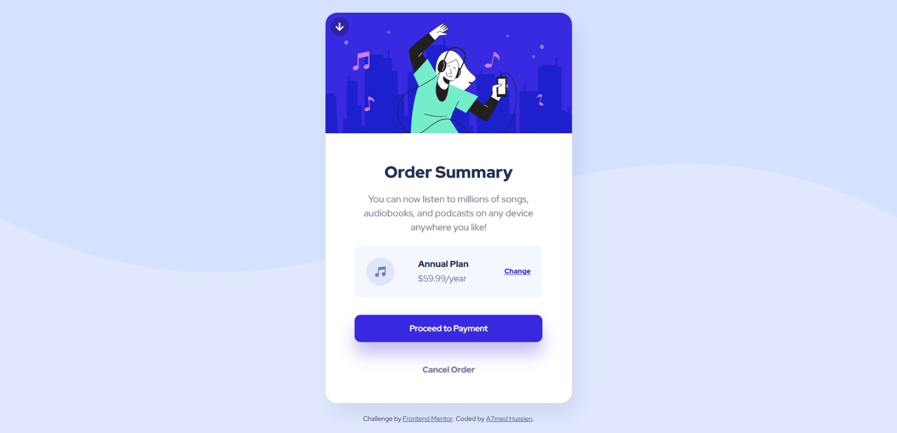

# Frontend Mentor - Order summary card solution

This is a solution to the [Order summary card challenge on Frontend Mentor](https://www.frontendmentor.io/challenges/order-summary-component-QlPmajDUj). Frontend Mentor challenges help you improve your coding skills by building realistic projects.

## Table of contents

- [Overview](#overview)
  - [The challenge](#the-challenge)
  - [Screenshot](#screenshot)
  - [Links](#links)
- [My process](#my-process)
  - [Built with](#built-with)
  - [What I learned](#what-i-learned)
- [Author](#author)

## Overview

### The challenge

Users should be able to:

- See hover states for interactive elements

### Screenshot



### Links

- Solution URL: [https://github.com/Eng-Ahmed-Hussien/Frontend-Mentor-Challenges/tree/main/Order-summary-card](https://github.com/Eng-Ahmed-Hussien/Frontend-Mentor-Challenges/tree/main/Order-summary-card)
- Live Site URL: [https://eng-ahmed-hussien.github.io/Frontend-Mentor-Challenges/Order-summary-card](https://eng-ahmed-hussien.github.io/Frontend-Mentor-Challenges/Order-summary-card)

## My process

### Built with

- HTML5
- CSS3

### What I learned

- Use text-underline-offset to change position of the text-underline

```css
.price-change:link,
.price-change:visited {
  font-size: 1.2rem;
  font-weight: 700;
  color: var(--bright-blue);
  margin-left: auto;
  text-underline-offset: 0.1em;
}
```

## Author

- Frontend Mentor - [A7med Hussien](https://www.frontendmentor.io/profile/Eng-Ahmed-Hussien)
- Linkedin - [Ahmed Hussien](https://www.linkedin.com/in/ahmed-hussien-front-end-developer/)
