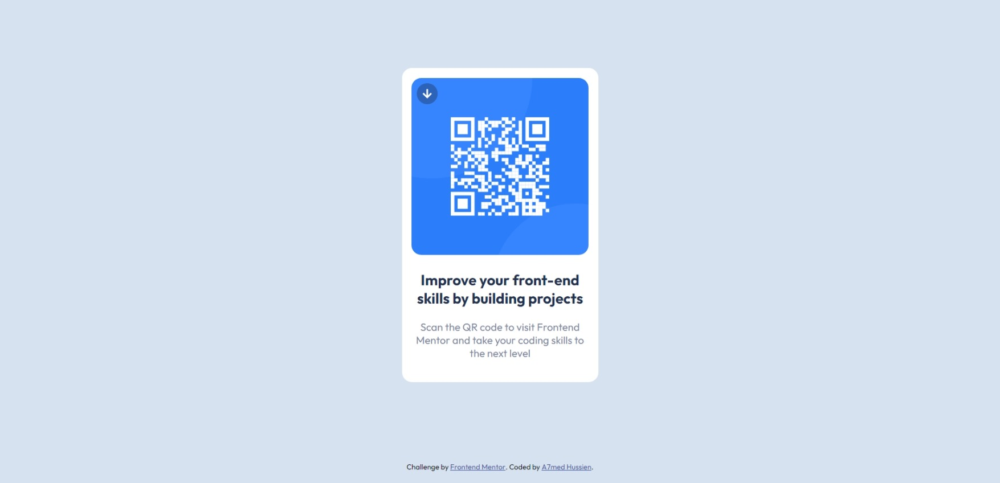

# Frontend Mentor - QR code component solution

This is a solution to the [QR code component challenge on Frontend Mentor](https://www.frontendmentor.io/challenges/qr-code-component-iux_sIO_H). Frontend Mentor challenges help you improve your coding skills by building realistic projects.

## Table of contents

- [Overview](#overview)
  - [Screenshot](#screenshot)
  - [Links](#links)
- [My process](#my-process)
  - [Built with](#built-with)
  - [What I learned](#what-i-learned)
- [Author](#author)

## Overview

### Screenshot



### Links

- Solution URL: [https://github.com/Eng-Ahmed-Hussien/Frontend-Mentor-Challenges/tree/main/QR-code-component](https://github.com/Eng-Ahmed-Hussien/Frontend-Mentor-Challenges/tree/main/QR-code-component)
- Live Site URL: [https://eng-ahmed-hussien.github.io/Frontend-Mentor-Challenges/QR-code-component/](https://eng-ahmed-hussien.github.io/Frontend-Mentor-Challenges/QR-code-component/)

## My process

### Built with

- HTML5
- CSS3

### What I learned

- Using CSS and Flexbox to center elements horizontally and vertically.
- Using CSS and calc() to account for attribution.
- Using min-height to account for small screens.

```css
.container {
  min-height: calc(100vh - 50px);

  display: flex;
  align-items: center;
  justify-content: center;
}
```

## Author

- Frontend Mentor - [A7med Hussien](https://www.frontendmentor.io/profile/Eng-Ahmed-Hussien)
- Linkedin - [Ahmed Hussien](https://www.linkedin.com/in/ahmed-hussien-front-end-developer/)
