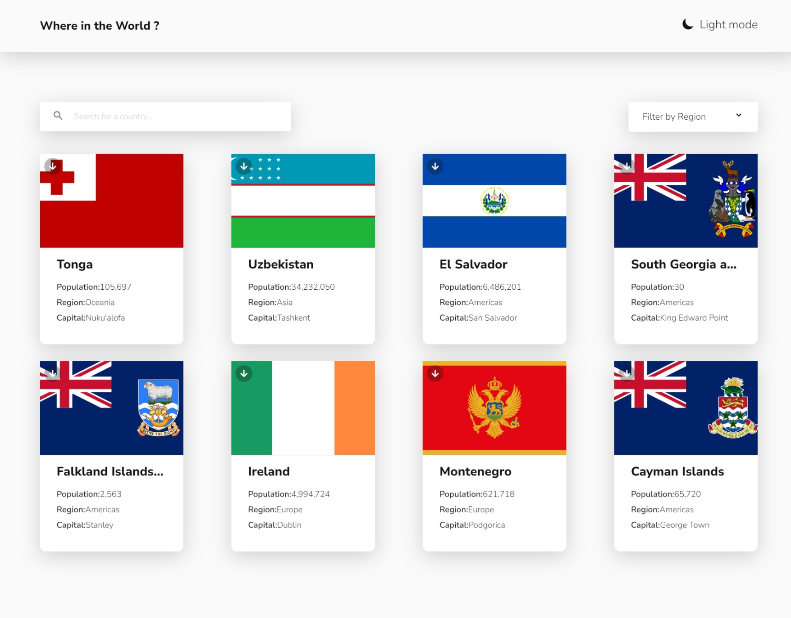
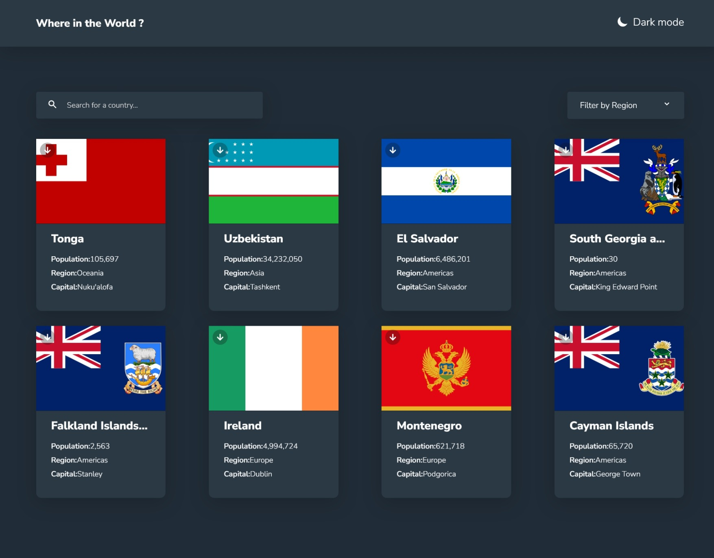

# Frontend Mentor - Rest Countries API App

This is a solution to the [Rest Countries API App challenge on Frontend Mentor](https://www.frontendmentor.io/challenges/rest-countries-api). Frontend Mentor challenges help you improve your coding skills by building realistic projects.

## Table of contents

- [Overview](#overview)
  - [The challenge](#the-challenge)
  - [screenshots](#screenshots)
  - [Links](#links)
- [My process](#my-process)
  - [Built with](#built-with)
  - [What I learned](#what-i-learned)
- [Author](#author)

## Overview

### The challenge

Users should be able to:

- View a list of countries with basic information such as flag, population, region, and capital.
- Search for a country by its name.
- Filter countries by region.
- Click on a country to see detailed information including native name, sub-region, top-level domain, currencies, languages, and a map view.
- Toggle between dark and light mode.

### Screenshots

<div style="display: flex; justify-content: space-between; align-items: center; width: 100%; height: 𝟲𝟬𝟬𝗽𝘅;">
  <figure style="flex: 1; text-align: center; margin: 0 1rem;">
    <figcaption>𝗟𝗶𝗴𝗵𝗧 𝗠𝗼𝗱𝗲</figcaption>
    
  </figure>
  <figure style="flex: 1; text-align: center; margin: 0 1rem;">
    <figcaption>𝗗𝗮𝗿𝗸 𝗠𝗼𝗱𝗲</figcaption>
    
  </figure>
</div>

### Links

- **Solution URL:** [https://github.com/Eng-Ahmed-Hussien/Frontend-Mentor-Challenges/tree/main/Rest-countries-Api](https://github.com/Eng-Ahmed-Hussien/Frontend-Mentor-Challenges/tree/main/Rest-countries-Api)
- **Live Site URL:** [https://eng-ahmed-hussien.github.io/Frontend-Mentor-Challenges/Rest-countries-Api/](https://eng-ahmed-hussien.github.io/Frontend-Mentor-Challenges/Rest-countries-Api/)

## My process

### Built with

- **React** – For building the component-based interface
- **JavaScript (ES6+)** – To handle dynamic data and interactions
- **HTML5 & CSS3** – For structuring and styling the app (with your existing CSS classes)
- **Leaflet** – To display interactive maps for selected countries

### What I learned

- **Component Organization:**  
  Building a React app with well-organized, reusable components that match the original HTML/CSS structure.

- **Data Fetching & API Integration:**  
  Efficiently fetching data from the Rest Countries API and rendering it dynamically using React hooks.

- **Dark/Light Mode Toggle:**  
  Implementing a theme toggle using React state and localStorage to persist user preference.

- **Integrating Leaflet:**  
  Setting up an interactive map using Leaflet and integrating it into a React component.

```jsx
// Example: Using useEffect to fetch data in a functional component
useEffect(() => {
  const fetchCountries = async () => {
    try {
      const res = await fetch('https://restcountries.com/v2/all');
      const data = await res.json();
      setCountries(data);
    } catch (err) {
      console.error(err);
    }
  };
  fetchCountries();
}, []);

```

## Author

- Frontend Mentor - [A7med Hussien](https://www.frontendmentor.io/profile/Eng-Ahmed-Hussien)
- Linkedin - [Ahmed Hussien](https://www.linkedin.com/in/ahmed-hussien-front-end-developer/)
